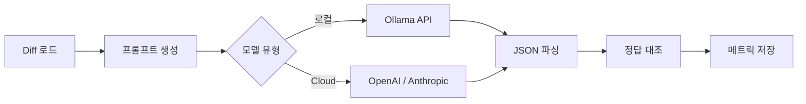
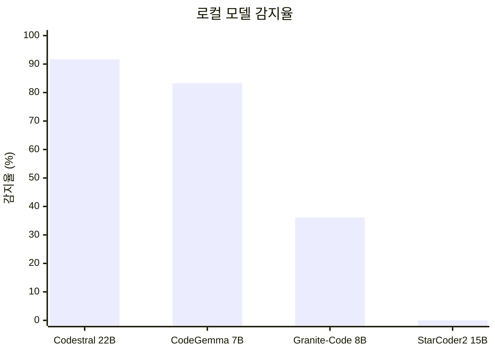
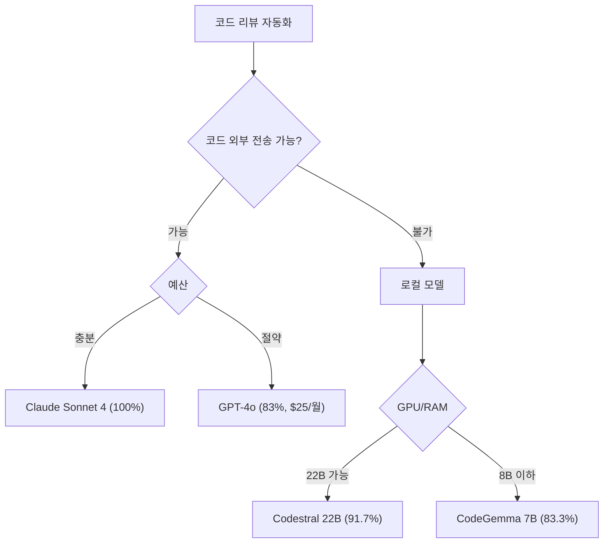

## 한눈에 보는 결과

| 모델 | 유형 | 감지율 | 시간 | 비용 |
|------|------|:------:|-----:|-----:|
| Claude Sonnet 4 | Cloud | **100%** | 416s | $0.564 |
| Codestral 22B | 로컬 | **91.7%** | 903s | $0 |
| CodeGemma 7B | 로컬 | **83.3%** | 621s | $0 |
| GPT-4o | Cloud | **83.3%** | 99s | $0.146 |
| Granite-Code 8B | 로컬 | 36.1% | 716s | $0 |
| StarCoder2 15B | 로컬 | 0% | 132s | $0 |

---

## 왜 이걸 해봤나

코드 리뷰에 LLM을 붙이는 시도가 늘고 있습니다. GitHub Copilot Code Review 같은 서비스도 나왔고, 직접 파이프라인을 구축하는 사례도 많아지고 있습니다.

그런데 막상 도입하려고 보면 고민이 생깁니다.

- GPT-4o나 Claude 같은 Cloud API를 쓰면 코드가 외부로 나갑니다
- 그렇다고 로컬 LLM을 쓰면 성능이 떨어지지 않을까?
- 실제로 얼마나 차이 나는지 데이터가 없습니다

Ollama 기반 오픈소스 모델 4종과 Cloud API 2종을 같은 diff로 테스트해서, 어떤 이슈를 잡아내고 어떤 걸 놓치는지 비교한 기록입니다.

---

## 실험 설계

### 테스트 환경

| 항목 | 사양 |
|------|------|
| 하드웨어 | Apple Silicon, 48GB Unified Memory |
| OS | macOS |
| 로컬 실행 | Ollama |
| Cloud API | OpenAI (GPT-4o), Anthropic (Claude Sonnet 4) |
| 벤치마크 코드 | Python 3.11 + httpx |

### 비교 모델

중국산 모델은 제외하고, 코드 리뷰에 쓸만한 모델 위주로 골랐습니다. 10B 이하 2종, 20B 이하 2종으로 나눠서 파라미터 크기별 차이도 같이 봤습니다.

| 모델 | 파라미터 | 유형 | 만든 곳 | 특징 |
|------|---------|------|---------|------|
| CodeGemma 7B | 7B | 로컬 | Google | 코드 특화, <abbr data-tip="Fill-in-Middle, 코드 중간 부분을 예측하여 채워넣는 기법">FIM</abbr> 지원 |
| Granite-Code 8B | 8B | 로컬 | IBM | 128K 컨텍스트, 116개 언어 |
| StarCoder2 15B | 15B | 로컬 | BigCode | 600+ 언어, 4T 토큰 학습 |
| Codestral 22B | 22B | 로컬 | Mistral AI | <abbr data-tip="HumanEval, OpenAI가 만든 코드 생성 능력 평가 벤치마크">HumanEval</abbr> 81%, 32K 컨텍스트 |
| GPT-4o | - | Cloud | OpenAI | 128K 컨텍스트 |
| Claude Sonnet 4 | - | Cloud | Anthropic | 200K 컨텍스트 |

### 테스트 데이터

보안 취약점, 설계 이슈, 성능 문제를 의도적으로 넣은 diff 3개를 준비했습니다.

| Diff | 줄 수 | 언어 | 심어둔 이슈 |
|------|-------|------|-----------|
| sample.diff | ~130줄 | Python | 하드코딩 비밀번호, <abbr data-tip="SQL Injection, 사용자 입력을 SQL 쿼리에 직접 삽입하여 발생하는 보안 취약점">SQL 인젝션</abbr>, 빈 except |
| springboot-ddd.diff | ~650줄 | Java | <abbr data-tip="Domain-Driven Design, 도메인 중심 설계. 비즈니스 로직을 도메인 레이어에 집중시키는 아키텍처 패턴">DDD</abbr> 레이어 위반, 트랜잭션 누락, <abbr data-tip="N+1 Query Problem, 1번의 쿼리로 N개 엔티티를 가져온 뒤 각각에 대해 추가 쿼리가 발생하는 성능 문제">N+1</abbr> |
| ecommerce-platform.diff | ~1200줄 | Java | 하드코딩 시크릿, <abbr data-tip="Message-Digest Algorithm 5, 이미 깨진 해시 함수로 비밀번호 저장에 사용하면 안 됨">MD5</abbr>, SQL 인젝션, <abbr data-tip="JSON Web Token, 인증 정보를 담는 토큰. signing key가 노출되면 토큰 위조가 가능">JWT</abbr> |

각 모델에 동일한 시스템 프롬프트를 주고, JSON 형식으로 이슈를 반환하도록 요청했습니다.

### 측정 지표

- **감지율**: 심어둔 이슈 중 몇 개를 찾았는지 (키워드 매칭)
- **리뷰 시간**: <abbr data-tip="Wall-clock Time, 실제 경과 시간. CPU 시간이 아닌 사용자가 체감하는 시간">wall-clock</abbr> 기준
- **JSON 파싱 성공률**: 자동화 파이프라인에 넣으려면 구조화된 출력이 필수입니다
- **토큰 / 비용**: Cloud 모델 한정

### 파이프라인

diff 안의 **모든 리뷰 대상 파일**을 각각 개별 리뷰하는 방식으로 테스트했습니다. ecommerce diff는 28개 파일이 들어있어서 모델당 28번 호출했습니다.

---

## 로컬 모델 결과

### 감지율

| 모델 | sample (3이슈) | springboot (4이슈) | ecommerce (4이슈) | 평균 | 총 시간 |
|------|---------------|-------------------|-------------------|------|---------|
| Codestral 22B | 100% | 75% | 100% | **91.7%** | 903s |
| CodeGemma 7B | 100% | 50% | 100% | **83.3%** | 621s |
| Granite-Code 8B | 33% | 50% | 25% | **36.1%** | 716s |
| StarCoder2 15B | 0% | 0% | 0% | **0%** | 132s |

### 모델별 소감

**Codestral 22B** — 91.7%로 GPT-4o(83.3%)보다 높게 나왔습니다. sample.diff의 하드코딩 비밀번호, SQL 인젝션, 빈 except를 전부 잡았고 ecommerce의 JWT 시크릿, MD5 해시까지 찾아냈습니다. springboot에서 트랜잭션 누락 하나만 놓쳤습니다. 대신 느려서 ecommerce 28파일 처리에 약 500초 걸렸습니다.

**CodeGemma 7B** — 7B인데 GPT-4o와 같은 83.3%가 나왔습니다. Codestral보다 30% 빠르고, JSON도 100% 깨지지 않았습니다. 메모리도 6~8GB면 되니까 웬만한 개발 머신에서 돌릴 수 있습니다.

**Granite-Code 8B** — 128K 컨텍스트가 스펙상 좋아 보여서 기대했는데, 실제로는 JSON 출력이 불안정했습니다. 많은 파일에서 0개 코멘트를 뱉거나, 갑자기 80초 넘게 걸리는 응답이 나왔습니다.

**StarCoder2 15B** — 코드 리뷰에는 못 씁니다. 48개 파일 전부 이슈 0개였습니다. JSON 대신 코드 완성 형태로만 응답했습니다. 코드 생성 모델이지 코드 리뷰 모델은 아닌 셈입니다. 15B라서 기대했는데 파라미터 수가 전부가 아니었습니다.

---

## Cloud 모델 결과

### 감지율

| 모델 | sample (6파일) | springboot (14파일) | ecommerce (28파일) | 평균 | 총 시간 |
|------|---------------|--------------------|--------------------|------|---------|
| Claude Sonnet 4 | **100%** | **100%** | **100%** | **100%** | 416s |
| GPT-4o | **100%** | **50%** | **100%** | **83.3%** | 99s |

Claude만 100%를 기록했습니다. GPT-4o는 springboot에서 트랜잭션 누락과 N+1을 놓쳤습니다.

### GPT-4o vs Claude Sonnet 4

| 항목 | GPT-4o | Claude Sonnet 4 |
|------|--------|-----------------|
| 감지율 | 83.3% | **100%** |
| 리뷰 스타일 | 간결, 핵심 위주 | 상세, 배경 설명 포함 |
| 파일당 코멘트 | ~2개 | ~5개 |
| <abbr data-tip="False Positive, 실제로는 문제가 아닌데 문제라고 잘못 판단하는 것">오탐</abbr> | 적음 | 보통 |
| 속도 (전체) | **99s** | 416s |
| 비용 (전체) | **$0.146** | $0.564 |

GPT-4o는 빠르고 저렴하지만, 아키텍처 수준 이슈는 Claude가 더 잘 잡습니다. Claude는 "왜 문제인지"까지 설명해주는 반면 GPT-4o는 핵심만 짚고 넘어갑니다.

### 토큰 소모량

| 모델 | Diff | Input | Output | 합계 | 비용 |
|------|------|-------|--------|------|------|
| GPT-4o | sample (6파일) | 3,413 | 504 | 3,917 | $0.014 |
| GPT-4o | springboot (14파일) | 10,804 | 886 | 11,690 | $0.036 |
| GPT-4o | ecommerce (28파일) | 21,544 | 4,290 | 25,834 | $0.097 |
| Claude Sonnet 4 | sample (6파일) | 4,916 | 1,508 | 6,424 | $0.037 |
| Claude Sonnet 4 | springboot (14파일) | 15,360 | 7,794 | 23,154 | $0.163 |
| Claude Sonnet 4 | ecommerce (28파일) | 31,027 | 18,002 | 49,029 | $0.363 |
| **합계** | | **87,064** | **32,984** | **120,048** | **$0.710** |

Claude가 출력 토큰을 3~4배 더 씁니다. 상세한 설명을 달아주는 만큼 비용도 올라갑니다.

> 기준 단가 — GPT-4o: input $2.50/1M, output $10.00/1M. Claude Sonnet 4: input $3.00/1M, output $15.00/1M (2026년 4월)

---

## 종합 비교

### 전체 결과

| 모델 | 유형 | 감지율 | 시간 | JSON | 비용 |
|------|------|-------|------|------|------|
| Claude Sonnet 4 | Cloud | **100%** | 416s | 100% | $0.564 |
| Codestral 22B | 로컬 | **91.7%** | 903s | 100% | $0 |
| CodeGemma 7B | 로컬 | **83.3%** | 621s | 100% | $0 |
| GPT-4o | Cloud | **83.3%** | 99s | 100% | $0.146 |
| Granite-Code 8B | 로컬 | 36.1% | 716s | 불안정 | $0 |
| StarCoder2 15B | 로컬 | 0% | 132s | 0% | $0 |

Codestral 22B가 GPT-4o보다 높게 나왔습니다.

### 속도 비교

ecommerce diff(28파일) 기준으로 속도 차이가 가장 큽니다.

| 모델 | sample | springboot | ecommerce |
|------|--------|------------|-----------|
| GPT-4o | 10.6s | 21.3s | **67s** |
| Claude Sonnet 4 | 34.8s | 121.0s | **260s** |
| CodeGemma 7B | 29.2s | 393.9s | **198s** |
| Codestral 22B | 79.2s | 316.3s | **508s** |

> 로컬 LLM이 느린 건 모델 문제가 아니라 하드웨어 차이입니다. Cloud는 <abbr data-tip="High Bandwidth Memory, GPU 전용 초고속 메모리. 일반 DDR 대비 대역폭이 5~10배 높음">HBM</abbr> 2~3TB/s 대역폭의 A100/H100에서 돌리지만, Apple Silicon은 ~400GB/s <abbr data-tip="Unified Memory, CPU와 GPU가 같은 메모리 풀을 공유하는 Apple Silicon의 메모리 아키텍처">Unified Memory</abbr>에서 단일 디바이스로 순차 실행됩니다. 거기에 Cloud LLM은 <abbr data-tip="Speculative Decoding, 작은 모델이 초안을 빠르게 생성하고 큰 모델이 검증하는 방식으로 토큰 생성 속도를 높이는 기법">speculative decoding</abbr>, <abbr data-tip="Continuous Batching, 요청이 완료될 때마다 새 요청을 즉시 배치에 추가하여 GPU 활용률을 높이는 스케줄링 기법">continuous batching</abbr>으로 분산 처리까지 하기 때문에 차이가 날 수밖에 없습니다. 전용 GPU 서버를 쓰면 로컬 모델도 훨씬 빨라집니다.

### 비용 추산

PR 규모별로 Cloud 비용을 계산해보면 다음과 같습니다.

| 월간 PR | diff 크기 | GPT-4o | Claude Sonnet 4 |
|---------|----------|--------|-----------------|
| 100건 | Small | ~$1.4 | ~$3.7 |
| 100건 | Medium | ~$3.6 | ~$16.3 |
| 100건 | Large | ~$9.7 | ~$36.3 |
| 500건 | Mixed | ~$24.5 | ~$94 |

GPT-4o는 월 $25 수준이면 500건도 처리할 수 있습니다. Claude는 상세한 리뷰를 원할 때 쓸 만하지만 비용이 3~4배 듭니다. 로컬 모델은 하드웨어 초기 비용 외에는 추가 비용이 없습니다.

> diff 전처리로 테스트 파일이나 lock 파일을 제외하면 토큰을 20~40% 줄일 수 있습니다.

### 보안

| 항목 | 로컬 | Cloud |
|------|------|-------|
| 코드 외부 전송 | 없음 | 있음 |
| 데이터 보존 | 자체 관리 | 공급사 정책 |
| 규정 준수 | 용이 | 별도 계약 필요 |

코드가 외부로 나가면 안 되는 환경이라면 로컬 모델을 써야 합니다.

---

## 결론

로컬 모델이 생각보다 잘 나왔습니다.

Codestral 22B(91.7%)가 GPT-4o(83.3%)보다 높았고, CodeGemma 7B도 7B로 GPT-4o와 같은 수치를 기록했습니다. Claude Sonnet 4만 100%였지만, 비용이나 보안 때문에 로컬 모델을 써야 하는 상황이라면 충분히 쓸 수 있는 수준입니다.

### 어떤 모델을 쓸까

| 상황 | 추천 | 감지율 | 이유 |
|------|------|--------|------|
| 코드 유출 불가 | Codestral 22B | 91.7% | GPT-4o 이상, 로컬 실행 |
| GPU/RAM 부족 | CodeGemma 7B | 83.3% | 6GB면 충분, GPT-4o 동급 |
| 최고 품질 | Claude Sonnet 4 | 100% | 설계 이슈까지 잡음 |
| 빠른 응답 | GPT-4o | 83.3% | 99초, 비용 합리적 |
| 하이브리드 | CodeGemma + Claude | - | 1차 필터 + 2차 정밀 리뷰 |

### 남은 과제

- 프롬프트 튜닝으로 감지율을 더 올릴 수 있는지
- <abbr data-tip="Few-shot Learning, 소수의 예시를 프롬프트에 포함시켜 모델의 출력 품질을 높이는 기법">few-shot</abbr> 예시를 모델별로 최적화하면 차이가 줄어드는지
- 실제 PR에 붙여서 운용할 때 오탐률이 어떤지

> 이 벤치마크는 특정 diff 셋 기준입니다. 언어나 코드 스타일이 다르면 결과도 달라질 수 있으니, 자기 코드베이스로 직접 돌려보는 걸 권장합니다.

---

*실험 코드는 [GitHub](https://github.com/geonhos/offline-code-reivew-agent)에 올려뒀습니다.*
