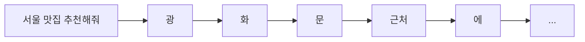
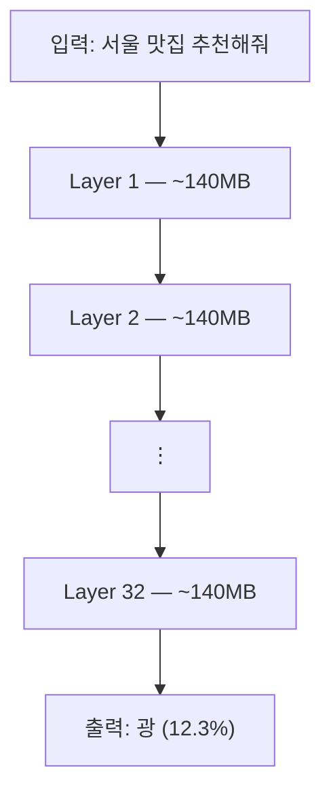
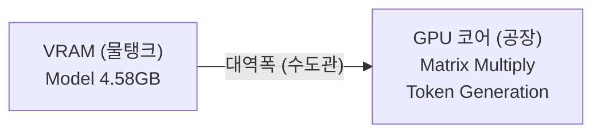
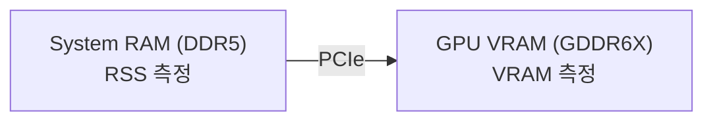
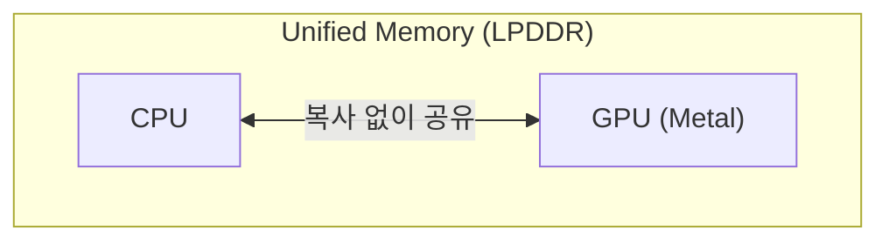
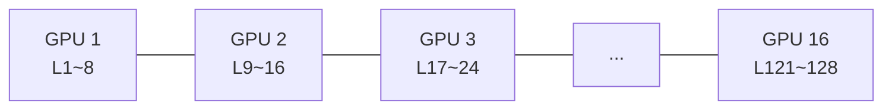

## 들어가며

ChatGPT나 Claude를 쓰다 보면 자연스럽게 드는 궁금증이 있습니다 — "이거 왜 이렇게 비싼 GPU가 필요하지?"

LLM은 글자를 한 번에 만들어내는 게 아니라 **한 토큰씩 순차적으로 예측**합니다. 그리고 토큰 하나를 만들 때마다 **모델 전체를 읽어야** 합니다. 이 구조를 이해하면 왜 GPU가 필요하고, 왜 메모리 대역폭이 성능을 좌우하는지 자연스럽게 따라옵니다.

> **대상 독자**: "LLM이 왜 비싼 GPU가 필요한지" 궁금한 입문~중급 개발자. 토큰 생성 원리부터 시작해 하드웨어 선택까지 다루고, 클라우드 서빙은 개요 수준으로 소개합니다.

**이 글에서 다루는 내용:**
- 토큰 생성 원리와 모델 내부 구조
- GPU 메모리에 모델을 올려야 하는 이유
- 메모리 대역폭이 성능을 결정하는 구조
- 하드웨어 아키텍처와 성능 비교
- 클라우드 LLM 서빙 개요

---

## 1. 토큰 생성이란

### 토큰이 뭔가

<abbr data-tip="Token, LLM이 텍스트를 처리하는 최소 단위. 단어·음절·서브워드 등 다양한 크기로 나뉜다">토큰</abbr>은 LLM이 텍스트를 처리하는 **최소 단위**입니다. 단어 하나가 토큰 하나일 수도 있고, 긴 단어는 여러 토큰으로 쪼개지기도 합니다.

| 텍스트 | 토큰 분리 예시 | 토큰 수 |
|:---|:---|---:|
| Hello | \[Hello\] | 1 |
| Transformer | \[Trans\] \[former\] | 2 |
| 서울 | \[서울\] | 1 |
| 맛집 추천 | \[맛\] \[집\] \[추천\] | 3 |

한국어는 영어보다 토큰이 더 잘게 쪼개지는 경향이 있습니다. LLM의 학습 데이터에 영어 비중이 높아서 영어 단어를 더 효율적으로 인코딩하기 때문입니다. 같은 문장이라도 한국어가 더 많은 토큰을 소비하고, 이는 곧 더 많은 연산과 비용으로 이어집니다.

### 한 토큰씩 순차 생성

LLM에게 질문하면, 모델은 **다음에 올 토큰을 하나씩 예측**합니다.



ChatGPT나 Claude에서 글자가 한 글자씩 타이핑되듯 나오는 게 이 때문입니다. 한 번에 답을 만드는 게 아니라 **한 토큰씩 순차적으로 생성**합니다.

### 토큰 하나를 어떻게 예측하나

"서울 맛집 추천해줘" 다음에 올 토큰을 예측하려면, 모델은 **모든 가능한 단어 중에서 확률이 가장 높은 것**을 골라야 합니다.

```
다음 토큰 후보:
"광" → 12.3%
"강" → 8.7%
"종" → 6.1%
"을" → 3.2%
"the" → 0.001%
... (수만 개 후보 중 확률 계산)
```

이 확률을 계산하는 과정이 **추론**(inference)이고, 여기에 행렬 곱셈이 쓰입니다.

---

## 2. 토큰 하나 = 모델 전체 읽기

### 모델 내부 구조

모델 내부는 여러 **레이어**(layer)가 쌓인 구조입니다. 레이어란 입력 데이터를 변환하는 연산 블록으로, 각 레이어에는 <abbr data-tip="Attention, Self-Attention 등 입력 토큰 간의 관계를 계산하는 메커니즘">어텐션</abbr>과 <abbr data-tip="Feed-Forward Network, 어텐션 결과를 비선형 변환하는 신경망 레이어">피드포워드</abbr> 연산을 수행하는 가중치(weights)가 들어 있습니다. 레이어 수는 모델 설계 시 결정하는 하이퍼파라미터로, 모델마다 다릅니다.

| 모델 | 파라미터 | 레이어 수 |
|:---|---:|---:|
| Llama 3.1 8B | 8B | 32 |
| Llama 3.1 70B | 70B | 80 |
| Llama 3.1 405B | 405B | 126 |

레이어가 많을수록 더 복잡한 패턴을 학습할 수 있지만, 그만큼 가중치가 늘어나 메모리와 연산량이 커집니다.



> llama3.1:8b 기준: 32개 레이어, 합계 ~4.58GB

토큰 하나를 예측하려면 **32개 레이어를 전부 통과**해야 합니다. 1층만 거쳐선 답이 안 나옵니다. 전체를 통과해야 비로소 "다음 토큰은 이거다"라는 확률 분포가 나옵니다.

### 매 토큰마다 전체 읽기

```
"광" 생성 → 4.58GB 전체 읽기 (32개 레이어 통과)
"화" 생성 → 4.58GB 전체 읽기 (또 32개 레이어 통과)
"문" 생성 → 4.58GB 전체 읽기 (또 32개 레이어 통과)
...
```

100 토큰짜리 답변이면 4.58GB를 **100번** 읽습니다. "한 번 로드하고 끝"이 아닙니다.

### 연산의 실체

토큰 하나를 생성할 때마다 일어나는 일:

```
입력 벡터 [1×4096] × 가중치 행렬 [4096×4096] = 출력 [1×4096]
                            ↑
                      이게 "모델"의 실체
```

이 행렬 곱셈이 레이어 수(32개)만큼 반복됩니다. 한 번의 토큰 생성에 8B 모델 기준 **수십억 번의 곱셈+덧셈**이 필요하고, 이 연산들은 서로 독립적이라 **병렬 처리가 가능**합니다.

---

## 3. 왜 GPU 메모리에 올리는가

### CPU vs GPU 구조

| | CPU | GPU |
|:---|:---|:---|
| 연산 유닛 | 8~24개 | 수천~수만 개 |
| 특성 | 범용, 순차 처리에 강함 | 단순 병렬 연산에 특화 |
| 비유 | 박사 4명이 논문 쓰기 | 공장 노동자 수천 명이 나사 조이기 |

> Apple이 말하는 "GPU 20코어"와 NVIDIA의 "16,384 CUDA 코어"는 단위가 다릅니다.
> Apple의 GPU 1코어 안에는 연산 유닛(ALU)이 ~128개 들어있어서, 20코어 GPU의 실제 연산 유닛은 약 2,560개입니다.
> NVIDIA의 CUDA 코어는 연산 유닛 하나하나를 세는 방식이라 숫자가 훨씬 큽니다.

LLM 추론의 핵심인 행렬 곱셈은 수천 개의 독립 연산으로 분해됩니다:

```
CPU: 4096×4096 = 1,677만 번 연산, 8코어로 나눠도 코어당 ~200만 번 → 느림
GPU: 4096×4096 = 1,677만 번 연산, 수천 유닛이 동시에 처리 → 빠름
```

### 메모리 위치가 성능을 결정한다

모델 가중치가 GPU 메모리에 있어야 GPU 코어들이 바로 접근해서 연산할 수 있습니다. 가중치가 시스템 RAM에 있으면:


매 레이어마다 RAM↔GPU 사이를 왕복하면, 전송 시간이 연산 시간보다 커집니다. 모델이 어디에 있느냐만으로 **30배 차이**가 나는 겁니다.

---

## 4. 메모리 대역폭

### 대역폭 = 한 번에 얼마나 많이 옮길 수 있는가

```
용량(capacity) = 물탱크 크기 → "몇 리터 담을 수 있나"
대역폭(bandwidth) = 수도관 굵기 → "초당 몇 리터 흐르나"
```

<abbr data-tip="Video RAM, GPU 전용 메모리 영역">VRAM</abbr> 24GB라는 건 물탱크가 24리터라는 뜻이고, 대역폭 1,008GB/s라는 건 수도관으로 **초당 1,008GB가 흐를 수 있다**는 뜻입니다.

모델은 이미 VRAM에 올라가 있습니다. 용량은 충분합니다. 문제는 올라가 있는 데이터를 GPU 코어가 **얼마나 빨리 읽어올 수 있느냐**입니다.



- 수도관이 **굵으면**(대역폭 높으면) → 데이터가 빨리 도착 → 토큰 빨리 생성
- 수도관이 **가늘면**(대역폭 낮으면) → 데이터가 느리게 도착 → GPU가 놀면서 대기

### 대역폭을 결정하는 두 가지

```
대역폭 = 버스 폭 × 클럭 속도
버스 폭 = 차선 수 (한 번에 몇 대가 나란히 갈 수 있나)
클럭 속도 = 제한 속도 (차가 얼마나 빨리 달리나)
```

참고로 대역폭(bandwidth)과 지연시간(latency)은 다른 개념입니다. 대역폭은 **초당 총 운반량**(→ tok/s에 직접 영향), 지연시간은 **한 건이 도착하는 시간**(→ 첫 토큰까지 시간에 영향)입니다.

---

## 5. 하드웨어 아키텍처와 성능 비교

### UMA vs 분리 메모리

**NVIDIA (분리 메모리 구조)**



> 물리적으로 분리된 두 메모리

- CPU용 RAM과 GPU용 VRAM이 **물리적으로 분리**
- 모델 로드 시 디스크 → RAM → PCIe → VRAM으로 **복사**

**Apple Silicon (<abbr data-tip="Unified Memory Architecture, CPU와 GPU가 같은 물리 메모리를 공유하는 구조">UMA</abbr>)**



- CPU와 GPU가 **같은 물리 메모리** 사용
- 모델 데이터를 GPU로 "복사"하는 게 아니라 **같은 메모리를 양쪽에서 접근**
- PCIe 병목이 없어서 모델 로딩이 빠름

### 메모리 타입과 대역폭 — 왜 NVIDIA가 더 빠른가

NVIDIA가 빠른 이유는 "분리되어서"가 아니라 **대역폭 최적화된 전용 메모리**를 쓰기 때문입니다. 아래 스펙은 각 제조사 공식 페이지 기준입니다.

| 하드웨어 | VRAM | 메모리 타입 | 버스 폭 | 대역폭 | 출처 |
|:---|:---|:---|---:|---:|:---|
| Apple M1 Pro | 통합 최대 32GB | <abbr data-tip="Low-Power DDR5, 모바일/저전력 환경에 최적화된 메모리">LPDDR5</abbr> | 256-bit | 200 GB/s | [Apple Newsroom](https://www.apple.com/newsroom/2021/10/introducing-m1-pro-and-m1-max-the-most-powerful-chips-apple-has-ever-built/) |
| Apple M4 Max (40코어 GPU) | 통합 최대 128GB | <abbr data-tip="Low-Power DDR5X, LPDDR5의 고속 개선 버전">LPDDR5X</abbr> | 512-bit | 546 GB/s | [Apple 공식](https://support.apple.com/en-us/121553) |
| NVIDIA RTX 4090 | 24GB | <abbr data-tip="Graphics Double Data Rate 6X, 고성능 그래픽 전용 메모리">GDDR6X</abbr> | 384-bit | 1,008 GB/s | [NVIDIA 공식](https://www.nvidia.com/en-us/geforce/graphics-cards/40-series/rtx-4090/) |
| NVIDIA RTX 5090 | 32GB | <abbr data-tip="Graphics Double Data Rate 7, GDDR6X의 차세대 고속 메모리">GDDR7</abbr> | 512-bit | 1,792 GB/s | [NVIDIA 공식](https://www.nvidia.com/en-us/geforce/graphics-cards/50-series/rtx-5090/) |
| NVIDIA H100 SXM5 | 80GB | <abbr data-tip="High Bandwidth Memory 3, 수천 비트 버스 폭으로 극한 대역폭을 제공하는 메모리">HBM3</abbr> | 5,120-bit | 3,350 GB/s | [NVIDIA 공식](https://www.nvidia.com/en-us/data-center/h100/) |
| NVIDIA H200 | 141GB | <abbr data-tip="HBM3의 개선 버전, 더 높은 대역폭과 용량을 제공">HBM3e</abbr> | 5,120-bit | 4,800 GB/s | [NVIDIA 공식](https://www.nvidia.com/en-us/data-center/h200/) |

고속도로에 비유하면:

```
LPDDR5 = 256차선 일반도로 (200 GB/s)
GDDR6X = 384차선 고속도로 (1,008 GB/s)
GDDR7 = 512차선 차세대 (1,792 GB/s)
HBM3 = 5,120차선 전용도로 (3,350 GB/s)
```

**인터커넥트 대역폭:**

| 인터커넥트 | 대역폭 | 출처 |
|:---|---:|:---|
| PCIe 4.0 x16 | ~31.5 GB/s (단방향) | [PCI-SIG 스펙](https://en.wikipedia.org/wiki/PCI_Express) |
| NVLink 4.0 (H100) | 900 GB/s (양방향) | [NVIDIA 기술 블로그](https://developer.nvidia.com/blog/nvidia-hopper-architecture-in-depth/) |

### 성능 비교 — llama3.1:8b (Q4_K_M, 4.58GB) 기준

> **주의**: tok/s 수치는 `대역폭(GB/s) ÷ 모델 크기(GB)`로 계산한 **이론 최대값**입니다.
> 실제 성능은 오버헤드로 **이론값의 70~90%** 수준입니다.

| 환경 | 대역폭 | 예상 tok/s | 200토큰 응답 | 체감 |
|:---|---:|---:|---:|:---|
| NVIDIA H100 SXM5 | 3,350 GB/s | 512~658 | **0.3초** | 즉시 |
| NVIDIA RTX 5090 | 1,792 GB/s | 274~352 | **0.7초** | 거의 즉시 |
| NVIDIA RTX 4090 | 1,008 GB/s | 150~198 | **1.2초** | 카톡 답장 수준 |
| Apple M4 Max | 546 GB/s | 80~107 | **2.2초** | 잠깐 기다리면 옴 |
| Apple M1 Pro | 200 GB/s | 30~40 | **5.7초** | 로딩 느낌 |
| CPU만 (DDR5) | 50 GB/s | 8~10 | **22초** | "멈춘 거 아냐?" |
| PCIe 경유 (RAM→GPU) | 31.5 GB/s | 5~6 | **40초** | ~30배 느림 |

같은 RTX 4090이라도 모델이 VRAM에 있으면 1.2초, RAM에 있으면 40초 — **모델이 어디에 있느냐**만으로 30배 차이가 납니다.

> **실측 참고**: Apple Silicon(48GB 통합 메모리) 환경에서 Ollama로 llama3.1:8b를 실행한 결과, 실제 **47 tok/s**를 기록했습니다. 이론값(30~40 tok/s)보다 높은 이유는 통합 메모리의 Metal 가속 최적화 덕분입니다. 모델별 상세 실측 데이터는 [Ollama 메모리 관리](/posts/ollama-memory-management/) 편에서 확인할 수 있습니다.

### 각자 잘하는 게 다르다

| | NVIDIA (RTX 4090) | Apple (M4 Max) |
|:---|:---|:---|
| 속도 | ~120 tok/s | ~60 tok/s |
| 최대 모델 크기 | **24GB까지만** | **128GB도 가능** |
| 전력 | 300W+ (콘센트 필수) | 20~40W (배터리 OK) |
| 가격 | GPU만 250만원+ | 노트북 통째로 |
| 소음 | 팬 소음 있음 | 무소음 가능 |

```
8B (4.58GB) → NVIDIA 압승 (속도 2~3배)
70B (40GB) → RTX 4090 VRAM 부족, Apple M4 Max 128GB는 가능
빠른 소형 모델 → NVIDIA / 느린 대형 모델 → Apple / 둘 다 → H100
```

### VRAM은 추가할 수 없다

VRAM은 GPU 기판에 **납땜**(soldered)되어 있어서 교체/추가가 불가능합니다. RAM처럼 슬롯에 꽂는 구조가 아닙니다. 모델이 VRAM에 들어가느냐 안 들어가느냐가 **하드웨어 선택 자체를 결정**합니다.

| 모델 크기 | 선택지 |
|:---|:---|
| 24GB 이내 | RTX 4090 가성비 최고 |
| 24~48GB | Apple M4 Max 또는 클라우드 |
| 48GB+ | 클라우드(H100/H200) 또는 Apple Ultra |

---

## 6. 클라우드 LLM 서빙

### 모델 크기의 현실

```
로컬:  llama3.1:8b → 4.58GB (노트북에서 가능)
클라우드: Claude/GPT-4 → 수백 GB~TB, Llama 405B → 810GB (FP16)
```

H100 한 장의 VRAM이 80GB인데, 810GB 모델을 어떻게 올릴까요? **모델 병렬화**(Model Parallelism)로 GPU 여러 장에 쪼개서 올립니다.



> Llama 405B (810GB) → H100 16장 x 50GB = 800GB, NVLink 4.0 (900GB/s)으로 연결

쪼개는 방식은 크게 두 가지입니다. **텐서 병렬화**는 한 레이어를 여러 GPU가 나눠서 동시에 계산하고, **파이프라인 병렬화**는 레이어 그룹을 GPU별로 할당해 컨베이어 벨트처럼 흘립니다. 실제로는 둘을 조합해서 씁니다.

### 대규모 서빙의 핵심 기술

수백만 명이 동시에 쓰는 서비스에서는 모델 병렬화 외에도 여러 최적화 기술이 적용됩니다.

<details>
<summary><strong>주요 최적화 기술 (클릭하여 펼치기)</strong></summary>

| 기술 | 역할 |
|:---|:---|
| <abbr data-tip="요청이 완료될 때마다 새 요청을 동적으로 배치에 삽입하는 기법">Continuous Batching</abbr> | 수백 요청을 묶어서 GPU 활용률 극대화 |
| <abbr data-tip="KV Cache를 가상 메모리의 페이지처럼 관리하여 메모리 낭비를 줄이는 기법">PagedAttention</abbr> | KV Cache를 페이지 단위로 관리, 메모리 낭비 줄임 |
| <abbr data-tip="8비트 부동소수점 양자화, 모델 크기를 절반으로 줄이면서 품질을 유지">FP8 양자화</abbr> | 모델 크기 절반으로 줄이면서 품질 유지 |
| <abbr data-tip="작은 모델이 여러 토큰을 초안으로 생성하고, 큰 모델이 이를 한꺼번에 검증하는 기법">Speculative Decoding</abbr> | 작은 모델이 초안 → 큰 모델이 검증 (속도↑) |
| 로드 밸런서 | 수천 GPU 노드에 요청 분배 |

</details>

```
로컬:    1장 GPU, 8B 모델, 혼자 사용
클라우드: 수천 장 GPU, 수백B+ 모델, 수백만 명 동시 사용
→ 같은 원리(행렬곱 + 메모리 대역폭)를 극한까지 스케일업
```

---

## 7. 마치며

### 핵심 정리

| 개념 | 핵심 |
|:---|:---|
| 토큰 생성 | 다음 단어를 하나씩 순차 예측 |
| 토큰 = 모델 전체 읽기 | 매 토큰마다 모든 레이어 통과, 전체 가중치 읽기 |
| GPU에 올리는 이유 | 행렬 곱셈의 병렬 처리 + 메모리 접근 속도 |
| 메모리 대역폭 | tok/s를 직접 결정하는 가장 중요한 지표 |
| Apple vs NVIDIA | UMA(큰 모델) vs 전용 VRAM(빠른 속도) |
| 클라우드 서빙 | 모델 병렬화 + NVLink로 극한 스케일업 |

원리는 동일합니다 — **"모델을 GPU 메모리에 올리고, 대역폭이 빠를수록 토큰이 빨리 나온다."** 로컬에서 8B 모델을 돌리든, 클라우드에서 수백B 모델을 서빙하든, 이 한 줄이 전부입니다.

### 실전으로 이어가기

이 글에서 다룬 원리를 로컬 환경에서 직접 확인하고 싶다면, Ollama 성능 시리즈를 참고하세요.

- **[Ollama 메모리 관리](/posts/ollama-memory-management/)** — 모델 크기별 실측 VRAM 점유량, KV Cache 메모리 관계, 다중 모델 동시 운영

---

### 참고 자료

**하드웨어 스펙:**
- [NVIDIA RTX 4090 공식 스펙](https://www.nvidia.com/en-us/geforce/graphics-cards/40-series/rtx-4090/)
- [NVIDIA RTX 5090 공식 스펙](https://www.nvidia.com/en-us/geforce/graphics-cards/50-series/rtx-5090/)
- [NVIDIA H100 공식 스펙](https://www.nvidia.com/en-us/data-center/h100/)
- [NVIDIA H200 공식 스펙](https://www.nvidia.com/en-us/data-center/h200/)
- [Apple M1 Pro/Max 소개 — Apple Newsroom](https://www.apple.com/newsroom/2021/10/introducing-m1-pro-and-m1-max-the-most-powerful-chips-apple-has-ever-built/)
- [Apple M4 Max 스펙 — Apple Support](https://support.apple.com/en-us/121553)

**인터커넥트:**
- [PCI Express 스펙 — Wikipedia](https://en.wikipedia.org/wiki/PCI_Express)
- [NVIDIA Hopper Architecture In-Depth — NVIDIA Developer Blog](https://developer.nvidia.com/blog/nvidia-hopper-architecture-in-depth/)

