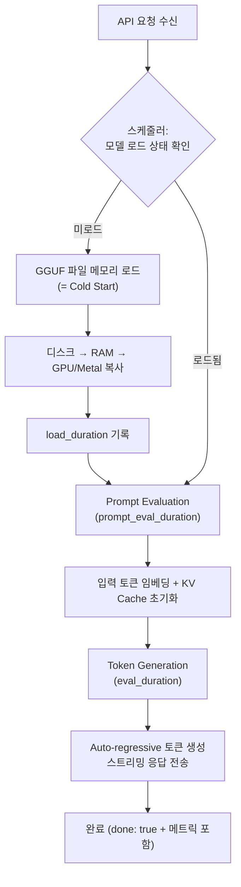

> Ollama 성능 시리즈 — 로컬 LLM을 프로덕션에 올리기 위해 알아야 할 것들을 실측 데이터로 정리합니다.
>
> 1. **[메모리 관리](/posts/ollama-memory-management/)** — 모델 크기별 리소스 점유와 최적화
> 2. **(현재) Cold Start** — 내부 동작부터 해결까지
> 3. **[동시 처리](/posts/ollama-concurrent-processing/)** — 병렬 슬롯, 큐잉, 그리고 처리량

---

## 들어가며

1편에서는 Ollama의 모델 크기별 메모리 점유를 직접 측정했습니다. 이번 글에서는 Ollama를 실서비스에 도입할 때 첫 번째로 부딪히는 문제 — **Cold Start**를 파헤칩니다.

첫 요청에 수백 밀리초~수 초(대형 모델/HDD 환경에서는 수십 초 이상)가 걸리는 이유가 무엇인지, 내부 파이프라인 수준에서 분석하고, 실측 데이터로 그 차이를 확인한 뒤, 해결 방법까지 정리합니다.

**이 글에서 다루는 내용:**
- Ollama의 요청 처리 파이프라인 (Cold vs Warm 경로)
- Cold Start vs Warm Start 실측 벤치마크 (5회 반복)
- keep_alive, 프리로드, 헬스체크를 통한 Cold Start 해소
- 프로덕션 환경 적용 시 주의사항

---

## 1. Ollama는 프롬프트를 어떻게 처리하는가

### 요청 수신부터 응답까지의 전체 흐름

Ollama의 `/api/generate` 엔드포인트에 요청이 도달하면 내부적으로 다음 파이프라인을 거칩니다:



### Cold Start vs Warm Start: 차이가 발생하는 지점

| 구간 | Cold Start | Warm Start |
| :--- | :--- | :--- |
| **load_duration** | <abbr data-tip="GGML Unified Format, llama.cpp 양자화 모델 파일 형식">GGUF</abbr> 파일 메모리 매핑 + 초기 페이지 로드 | 이미 메모리에 있으므로 대폭 감소 (실측 ~71ms) |
| **prompt_eval_duration** | <abbr data-tip="Key-Value Cache, 트랜스포머 어텐션 연산의 키-값 쌍을 저장하는 캐시">KV Cache</abbr> 초기 할당 포함 | 할당 완료 상태에서 실행 |
| **eval_duration** | 차이 없음 (순수 추론) | 차이 없음 |

핵심은 `load_duration`입니다. [1편](/posts/ollama-memory-management/)에서 측정한 것처럼 llama3.2:3b 모델은 약 5.8GB 메모리를 점유합니다. Cold Start 시에는 이 전체를 디스크에서 읽어야 합니다.

### Ollama 스케줄러와 모델 생명주기

Ollama는 `keep_alive` 타이머로 모델 생명주기를 관리합니다:


- **기본값**: 5분 (`OLLAMA_KEEP_ALIVE=5m`)
- 다중 모델 환경에서는 `OLLAMA_MAX_LOADED_MODELS`와 함께 메모리 기반 스케줄링이 적용됩니다 ([1편](/posts/ollama-memory-management/) 참조)

### API 응답 메트릭 해석

Ollama API의 최종 응답(`done: true`)에는 상세 메트릭이 포함됩니다:

| 메트릭 | 단위 | 의미 |
| :--- | :--- | :--- |
| `load_duration` | ns | 모델 로드 시간 (Cold Start의 핵심) |
| `prompt_eval_duration` | ns | 프롬프트 평가 시간 |
| `prompt_eval_count` | 개 | 입력 토큰 수 |
| `eval_duration` | ns | 토큰 생성 시간 |
| `eval_count` | 개 | 생성된 토큰 수 |
| `total_duration` | ns | 전체 소요 시간 |

**핵심 지표 계산:**
```
TTFT(첫 토큰 응답 시간) = load_duration + prompt_eval_duration
tokens/s(토큰 생성 속도) = eval_count / (eval_duration / 1e9)
```

> **주의**: 모든 시간 값은 **나노초(ns)** 단위입니다. ms로 변환하려면 `÷ 1,000,000`을 적용합니다.

---

## 2. Cold Start가 왜 문제인가

실서비스에서 Cold Start가 문제가 되는 대표적인 시나리오:

1. **UX 저하**: 사용자가 첫 요청에 수백ms~수십초를 기다려야 함
2. **<abbr data-tip="Service Level Agreement, 서비스 수준 협약">SLA</abbr> 위반**: API 응답 시간 보장 실패
3. **헬스체크 실패**: 컨테이너 오케스트레이터가 Cold Start 지연을 장애로 인식 → 재시작 루프
4. **반복적 발생**: keep_alive 기본값(5분) 이후 매번 Cold Start 재발생
5. **스케일링 지연**: 새 인스턴스 추가 시 초기 응답 지연

특히 Kubernetes 환경에서는 readinessProbe 타임아웃으로 인한 재시작 루프가 빈번하게 보고됩니다.

---

## 3. 실제로 얼마나 차이가 나는가 (벤치마크)

### 테스트 환경

| 항목 | 내용 |
| :--- | :--- |
| OS | macOS (Apple Silicon, arm64) |
| 메모리 | 48 GB |
| 가속기 | Metal (통합 메모리) |
| Ollama | v0.17.4 |
| 모델 | llama3.2:3b (Q4_K_M, 2.0GB) |
| 프롬프트 | "Explain what a cold start is in 2 sentences." |
| 반복 | 5회 (각 반복 전 모델 완전 언로드 / 로드 유지) |

> **통계적 한계 고지**: 5회 반복은 탐색적 분석 수준입니다. 정밀한 통계적 유의성을 보장하기 위해서는 30회 이상의 반복이 권장됩니다.

### Cold Start vs Warm Start 성능 비교

| 메트릭 | Cold Start (평균) | Warm Start (평균) | 배율 |
| :--- | :--- | :--- | :--- |
| **Load Duration** | 792.1 ms | 70.7 ms | 11.2x |
| **TTFT** | 881.1 ms | 81.3 ms | 10.8x |
| **Total Response** | 1,812.0 ms | 826.3 ms | 2.2x |
| **tokens/s** | 92.4 | 98.6 | 0.9x |


**핵심 발견:**

- **Load Duration이 11.2배** 차이납니다. Cold Start 시 ~792ms, Warm에서는 ~71ms로 모델이 이미 메모리에 있는지 여부가 결정적
- **<abbr data-tip="Time To First Token, 첫 번째 토큰이 응답되기까지의 시간">TTFT</abbr>는 10.8배** 차이. 사용자 체감으로는 Cold Start 시 약 0.9초, Warm에서는 0.08초
- **순수 추론 속도(tokens/s)는 거의 동일** (92.4 vs 98.6). 모델이 메모리에 올라간 후의 성능은 동일
- **전체 응답 시간은 2.2배** 차이. load_duration이 전체의 ~44%를 차지


### 반복별 안정성 분석

Cold Start와 Warm Start 모두 반복 간 안정적인 결과를 보였습니다:

| 메트릭 | Cold Stddev | Warm Stddev |
| :--- | :--- | :--- |
| Load Duration | 29.3 ms | 10.8 ms |
| TTFT | 27.4 ms | 10.7 ms |
| Total Response | 152.4 ms | 70.3 ms |
| tokens/s | 2.0 | 2.0 |


Cold Start의 편차가 더 크지만(stddev 29ms vs 11ms), Apple Silicon SSD의 빠른 읽기 속도 덕분에 편차는 비교적 작은 편입니다. HDD 환경에서는 이 편차가 크게 증가할 수 있습니다.


### 요약 테이블


---

## 4. Cold Start 해결 방법

### OLLAMA_KEEP_ALIVE 설정

가장 간단한 해결책은 모델 유지 시간을 늘리는 것입니다.

**환경변수 방식** (서버 전체 적용):
```bash
# 24시간 유지 — 업무 시간 동안 cold start 방지
export OLLAMA_KEEP_ALIVE=24h

# 영구 유지 — 메모리가 충분할 때
export OLLAMA_KEEP_ALIVE=-1

# 기본값: 5m
```

**API 파라미터 방식** (요청별 설정):
```bash
curl http://localhost:11434/api/generate -d '{
    "model": "llama3.2:3b",
    "prompt": "Hello",
    "keep_alive": "24h"
}'
```

| 설정 | 장점 | 단점 |
| :--- | :--- | :--- |
| `5m` (기본값) | 메모리 자동 회수 | 5분 간격으로 Cold Start 반복 |
| `24h` | 업무 시간 내 Warm 유지 | 미사용 시에도 메모리 점유 |
| `-1` (영구) | Cold Start 완전 제거 | 서버 재시작 전까지 메모리 영구 점유 |
| `0` (즉시 해제) | 최소 메모리 사용 | 매 요청마다 Cold Start |

> **주의**: API 파라미터가 환경변수보다 우선 적용됩니다. GitHub Issue [#5272](https://github.com/ollama/ollama/issues/5272)에서 일부 버전의 keep_alive 버그가 보고되었습니다.

### 모델 프리로드 (Warm-up)

서버 시작 직후 빈 요청으로 모델을 메모리에 미리 로드(프리로드)합니다:

```bash
# 프리로드 (빈 프롬프트 + 영구 유지)
curl http://localhost:11434/api/generate -d '{
    "model": "llama3.2:3b",
    "prompt": "",
    "keep_alive": "-1"
}'

# 로드 확인
curl http://localhost:11434/api/ps
```

**자동화 예시:**

```yaml
# Docker Compose — 서비스 시작 후 자동 프리로드
services:
  ollama:
    image: ollama/ollama
    healthcheck:
      test: curl -f http://localhost:11434/ || exit 1
  warmup:
    depends_on:
      ollama:
        condition: service_healthy
    command: >
      curl http://ollama:11434/api/generate
      -d '{"model":"llama3.2:3b","prompt":"","keep_alive":"-1"}'
```

```ini
# systemd — ExecStartPost로 프리로드
[Service]
ExecStart=/usr/local/bin/ollama serve
ExecStartPost=/usr/local/bin/ollama-preload.sh
```

### 헬스체크 및 자동 복구

프로덕션에서는 모델이 실제로 메모리에 로드되어 있는지 확인해야 합니다:

```bash
#!/bin/bash
# 1. 서버 생존 확인
curl -s http://localhost:11434/ | grep -q "Ollama is running"

# 2. 모델 다운로드 확인 (GET /api/tags)
#    → 디스크에 파일이 있는지 확인
curl -s http://localhost:11434/api/tags

# 3. 모델 메모리 로드 확인 (GET /api/ps) ← 핵심!
#    → 실제 GPU/RAM에 올라와 있는지 확인
curl -s http://localhost:11434/api/ps

# 4. 미로드 시 자동 프리로드
```

> **주의**: `/api/tags`는 다운로드 여부만 확인합니다. 메모리 로드 상태는 반드시 `/api/ps`로 확인해야 합니다.

### 해결 방법 비교표

| 방법 | 효과 | 복잡도 | 메모리 비용 | 적합한 환경 |
| :--- | :--- | :--- | :--- | :--- |
| **keep_alive 연장** | Cold Start 주기 감소 | 낮음 | 중간 | 개발/소규모 |
| **프리로드 + keep_alive=-1** | Cold Start 완전 제거 | 중간 | 높음 | 단일 모델 서비스 |
| **헬스체크 + 자동 복구** | 장애 자동 대응 | 중간 | 중간 | 프로덕션 |
| **전체 조합** | 최고 안정성 | 높음 | 높음 | 엔터프라이즈 |

---

## 5. 적용 시 주의사항

### 메모리 트레이드오프

`keep_alive=-1`은 Cold Start를 완전히 제거하지만, 모델이 메모리를 영구 점유합니다:

| 모델 | 메모리 점유 | keep_alive=-1 시 |
| :--- | :--- | :--- |
| llama3.2:1b | ~2.5 GB RSS | 상시 2.5 GB 점유 |
| llama3.2:3b | ~5.8 GB RSS | 상시 5.8 GB 점유 |
| llama3.1:8b | ~9.0 GB RSS | 상시 9.0 GB 점유 |

([1편](/posts/ollama-memory-management/) 실측 데이터 참조)

다중 모델을 동시에 `keep_alive=-1`로 유지하면 메모리 합산이 급격히 증가합니다.

### keep_alive 우선순위

```
API 파라미터 keep_alive > 환경변수 OLLAMA_KEEP_ALIVE > 기본값 5m
```

환경변수로 `24h`를 설정하더라도, API 요청에서 `"keep_alive": "5m"`을 보내면 해당 모델은 5분 후 언로드됩니다.

### Apple Silicon에서의 특이사항

Apple Silicon(Metal)은 **통합 메모리 아키텍처**를 사용합니다:
- GPU 전용 VRAM이 없어 시스템 메모리를 공유
- UMA 덕분에 CPU→GPU VRAM 별도 복사가 불필요하여 로드 과정이 단순
- SSD 속도가 빨라 Cold Start가 상대적으로 짧음 (우리 측정: ~792ms)
- x86 + 외장 GPU 환경에서는 PCIe 병목으로 Cold Start가 더 길어질 수 있음

---

## 6. 마치며

### 핵심 정리

| 항목 | 결과 |
| :--- | :--- |
| Cold Start 원인 | load_duration (전체 응답의 44%) |
| TTFT 차이 | Cold 881ms vs Warm 81ms (10.8x) |
| 추론 속도 차이 | 거의 없음 (~7%) |
| 가장 쉬운 해결책 | keep_alive 연장 (24h / -1) |
| 프로덕션 표준 | 프리로드 + 헬스체크 조합 |

### 다음 편 예고

- **3편: Ollama 동시 요청 처리의 이해와 최적화** — OLLAMA_NUM_PARALLEL과 Continuous Batching, 동시 요청 수별 성능 실측, 대기열 관리와 스케줄링 최적화 *(준비 중)*

---

### 참고 자료

- [Ollama API Documentation](https://github.com/ollama/ollama/blob/main/docs/api.md)
- [Ollama FAQ — keep_alive](https://github.com/ollama/ollama/blob/main/docs/faq.md)
- [GitHub Issue #5272 — keep_alive not effective](https://github.com/ollama/ollama/issues/5272)
