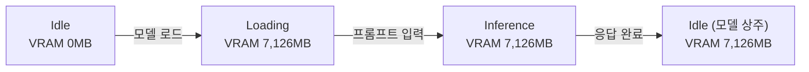
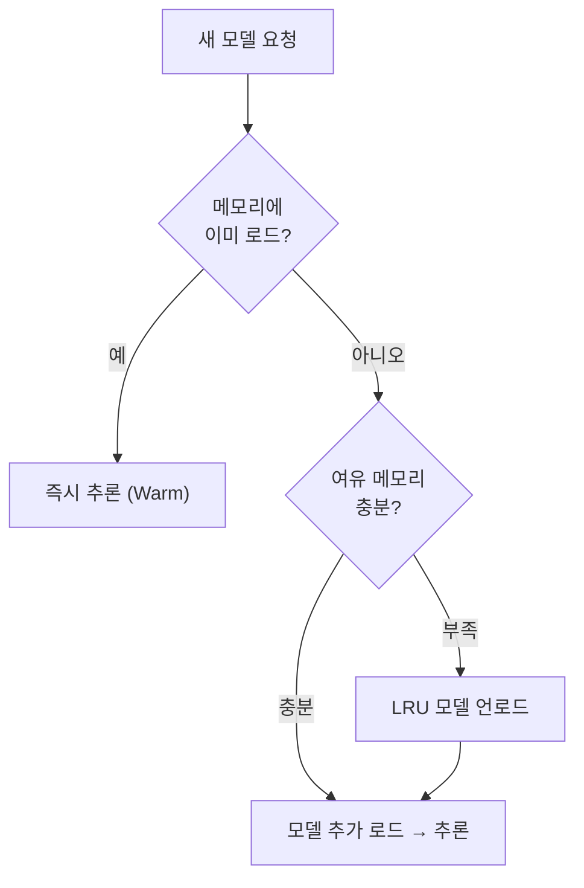

> Ollama 성능 시리즈 — 로컬 LLM을 프로덕션에 올리기 위해 알아야 할 것들을 실측 데이터로 정리합니다.
>
> 1. **(현재) 메모리 관리** — 모델 크기별 리소스 점유와 최적화
> 2. **Cold Start** — 내부 동작부터 해결까지 *(TODO)*
> 3. **동시 처리** — 병렬 슬롯, 큐잉, 그리고 처리량 *(TODO)*

---

## 들어가며

Ollama로 로컬 LLM을 운영할 때 가장 먼저 마주치는 질문이 있습니다 — "이 모델을 돌리려면 메모리가 얼마나 필요할까?"

모델 파일 크기와 실제 메모리 점유량은 같지 않습니다. <abbr data-tip="Key-Value Cache, 트랜스포머 어텐션 연산의 키-값 쌍을 저장하는 캐시">KV Cache</abbr>와 런타임 오버헤드 때문에 **실제 VRAM은 파일의 2~4배**입니다. 이 구조를 이해하면, 왜 4.58GB짜리 모델이 10GB 넘는 메모리를 차지하는지 자연스럽게 따라옵니다.

> 이 글의 배경이 되는 GPU/메모리 대역폭 개념은 [LLM은 왜 GPU가 필요한가](/posts/llm-serving-infrastructure/)에서 다룹니다.

**이 글에서 다루는 내용:**
- 모델 크기별(1B/3B/8B) 실제 메모리 점유량 실측
- <abbr data-tip="Quantization, 모델 가중치의 비트 수를 줄여 크기와 연산량을 낮추는 기법">양자화</abbr>(Q4 vs Q8)에 따른 메모리 차이
- 컨텍스트 크기(num_ctx)와 KV Cache 메모리 관계
- GPU/가속 코어 활용 패턴
- 다중 모델 동시 운영 시 메모리 관리
- 프로덕션 메모리 산정 가이드

---

## 1. 모델 크기별 메모리 점유량 실측

### 측정 환경과 방법

| 항목 | 내용 |
| :--- | :--- |
| OS | macOS (Apple Silicon, arm64) |
| 메모리 | 48 GB |
| 가속기 | Metal (통합 메모리) |
| Ollama | v0.17.4 |
| 측정 도구 | psutil (RSS), Ollama `/api/ps` (size_vram) |

**측정 방법:**
1. 전체 모델 언로드 → 깨끗한 baseline
2. 모델 로드 (빈 프롬프트) → <abbr data-tip="Resident Set Size, 프로세스가 실제 점유 중인 물리 메모리">RSS</abbr> / <abbr data-tip="Video RAM, GPU 전용 메모리 영역">VRAM</abbr> 측정
3. 추론 1회 실행 → 추론 중 RSS 측정
4. 모델 언로드

> **참고**: 메모리 측정은 모델별 단일 측정(N=1)으로, 반복 측정에 따른 통계적 유의성은 포함하지 않습니다. 메모리 점유는 시스템 상태에 따라 수십 MB 범위 내에서 변동될 수 있습니다. Cold Start / Warm Start별 성능 지표의 반복 측정 결과는 2편에서 확인할 수 있습니다. *(준비 중)*

### 파라미터 수별 메모리 비교

| 모델 | 파라미터 | 양자화 | 파일 크기 | RSS(로드) | RSS(추론) | VRAM(API) | tokens/s |
| :--- | :--- | :--- | :--- | :--- | :--- | :--- | :--- |
| llama3.2:1b | 1.2B | Q8_0 | 1.23 GB | 2,554 MB | 2,560 MB | 4,404 MB | 161 |
| llama3.2:3b | 3.2B | Q4_K_M | 1.88 GB | 5,800 MB | 5,810 MB | 7,126 MB | 96 |
| llama3.1:8b | 8.0B | Q4_K_M | 4.58 GB | 9,048 MB | 9,057 MB | 10,644 MB | 47 |


이사에 비유하면, 모델 파일 크기는 **짐의 부피**이고 실제 메모리 점유량은 **짐을 풀어놓을 방의 크기**입니다. 짐을 풀면 작업 공간(KV Cache), 도구(런타임 버퍼), 작업대(컴퓨트 그래프)가 추가로 필요하니, 방은 짐보다 훨씬 커야 합니다.

**핵심 발견:**
- **파일 크기 ≠ 메모리 점유량**: llama3.2:1b는 파일 1.23GB이지만 VRAM 4,404MB를 점유합니다. KV Cache, 런타임 버퍼, 컴퓨트 그래프 등 추가 메모리 할당 때문입니다.
- **VRAM(API) vs RSS**: Apple Silicon 통합 메모리 환경에서 `/api/ps`의 `size_vram`은 RSS보다 크게 측정됩니다. GPU 가속에 할당된 전체 메모리 영역을 포함하기 때문입니다.
- **로드 vs 추론 차이 미미**: 추론 중 RSS 증가는 10MB 미만으로, 토큰 생성 자체의 추가 메모리 오버헤드는 적습니다.
- **파라미터 대비 성능**: 1B→3B(2.6배)로 크기 증가 시 tokens/s는 161→96(40% 감소), 3B→8B(2.5배) 시 96→47(51% 감소).


### 양자화 참고 사항

위 표에서 llama3.2:1b는 <abbr data-tip="8비트 양자화">Q8_0</abbr>, llama3.2:3b와 llama3.1:8b는 <abbr data-tip="4비트 혼합 정밀도 양자화">Q4_K_M</abbr>이 기본 양자화입니다. 파라미터 수가 다르므로 양자화 효과를 직접 비교할 수는 없지만, 일반적인 이론값은 다음과 같습니다.

| 양자화 | 비트 수 | FP16 대비 크기 | 특징 |
| :--- | :--- | :--- | :--- |
| <abbr data-tip="16비트 부동소수점, 양자화를 적용하지 않은 원본 정밀도">FP16</abbr> | 16-bit | 1x (기준) | 최고 품질, 크기 최대 |
| Q8_0 | 8-bit | ~0.5x | 품질 거의 동일, 크기 절반 |
| Q4_K_M | 4-bit | ~0.25x | 품질 소폭 하락, 크기 1/4 |

같은 모델이라면 Q4는 Q8 대비 파일 크기와 메모리 점유가 약 **절반**으로 줄어듭니다. 프로덕션에서는 품질과 리소스 사이의 트레이드오프를 고려해야 합니다.

> **참고**: FP16 모델은 Ollama Hub에서 직접 제공하지 않습니다. Q4_K_M과 Q8_0이 가장 일반적인 선택지입니다.

### 컨텍스트 크기와 KV Cache

그렇다면 파일 크기 외에 메모리를 가장 크게 좌우하는 요소는 무엇일까요? 바로 `num_ctx`(컨텍스트 윈도우 크기)입니다.

KV Cache는 이전 대화 내용을 기억하는 **메모장**과 같습니다. 메모장 페이지가 많을수록(num_ctx가 클수록) 더 긴 대화를 기억할 수 있지만, 그만큼 책상 위 공간을 더 차지합니다. llama3.2:3b로 `num_ctx`만 변경하며 측정한 결과:

> **참고**: 아래 표는 KV Cache 증가분만 비교하기 위해 `num_ctx`를 명시적으로 지정하고 측정한 값입니다. 위 모델별 메모리 표의 llama3.2:3b RSS(5,800MB)는 Ollama 기본 num_ctx(모델 기본값)로 로드한 수치이므로, 이 표의 num_ctx=2048 baseline(2,431MB)과 차이가 있습니다.

| num_ctx | RSS (MB) | VRAM (MB) | VRAM 증가분 |
| :--- | :--- | :--- | :--- |
| 2,048 | 2,431 | 2,399 | (baseline) |
| 4,096 | 2,671 | 2,623 | +224 MB |
| 8,192 | 3,119 | 3,238 | +840 MB |

**핵심 발견:**
- num_ctx를 2배로 늘리면 KV Cache 메모리가 약 **224MB** 증가 (2048→4096)
- num_ctx를 4배로 늘리면 약 **840MB** 증가 (2048→8192)
- 증가폭이 선형이 아닌 이유: KV Cache는 `num_ctx × num_layers × head_dim × 2(K+V)`로 계산되며, 메모리 정렬/패딩 오버헤드가 추가됩니다

> **3편 연결**: `OLLAMA_NUM_PARALLEL`로 병렬 슬롯을 늘리면 슬롯마다 독립적으로 KV Cache가 할당됩니다. 자세한 내용은 3편에서 다룹니다. *(준비 중)*

---

## 2. GPU/가속 코어 활용 패턴

모델이 메모리에 올라갔다면, 다음 궁금증은 "GPU를 실제로 얼마나 쓰고 있는가?"입니다.

### macOS Metal 환경

Apple Silicon의 Metal GPU는 통합 메모리 아키텍처를 사용합니다. GPU utilization %는 직접 측정이 불가능하며, `powermetrics`(sudo 필요)로 전력/주파수만 간접 확인 가능합니다.



| 단계 | VRAM (MB) | CPU (%) | 시스템 메모리 (MB) |
| :--- | :--- | :--- | :--- |
| Idle | 0 | 16% | 23,134 |
| Loading | 7,126 | 18% | 27,119 |
| Inference | 7,126 | 15% | 27,238 |

- Loading 시 시스템 메모리가 약 **4GB** 증가 (모델 로드)
- Inference 시 VRAM 변화 없음 (이미 할당된 KV Cache 내에서 연산)
- CPU 사용률은 크게 변하지 않음 (Metal GPU가 추론 수행)

Metal GPU가 추론을 수행하는 구조와 메모리 대역폭이 tok/s 성능에 미치는 영향은 [LLM은 왜 GPU가 필요한가](/posts/llm-serving-infrastructure/) 편에서 상세히 다룹니다.

### Linux NVIDIA 환경 (참고)

Linux + NVIDIA GPU 환경에서는 `nvidia-smi`로 정확한 GPU utilization, memory used, temperature, power draw를 측정할 수 있습니다.

---

## 3. 다중 모델 동시 운영

모델 하나의 메모리 특성을 파악했다면, 실제 운영에서는 한 걸음 더 나아가야 합니다 — "모델 여러 개를 동시에 올릴 수 있을까?"

### Ollama의 모델 풀 관리

Ollama는 메모리가 충분하면 여러 모델을 동시에 메모리에 유지합니다. 카페에 비유하면, 자주 오는 단골(자주 사용하는 모델)의 자리를 미리 잡아두는 것과 같습니다. 새 손님이 오면 빈자리에 앉히고, 자리가 부족할 때만 가장 오래 안 온 손님(<abbr data-tip="Least Recently Used, 가장 오래 미사용된 항목을 우선 제거하는 정책">LRU</abbr>)부터 자리를 비웁니다.



### OLLAMA_MAX_LOADED_MODELS

| 설정 | 동작 |
| :--- | :--- |
| 미설정 (기본) | 가용 메모리에 따라 자동 관리 |
| `OLLAMA_MAX_LOADED_MODELS=1` | 한 번에 1개만 로드 (즉시 swap) |
| `OLLAMA_MAX_LOADED_MODELS=2` | 최대 2개 동시 유지 |

### 실측: 2개 모델 동시 로드

48GB 메모리 환경에서 동시 로드 결과:

| 조합 | A 로드 후 RSS | A+B 동시 RSS | A 유지? |
| :--- | :--- | :--- | :--- |
| 1b + 3b | 2,564 MB | 8,246 MB | 예 |
| 3b + 8b | 5,839 MB | 14,711 MB | 예 |

**핵심 발견:**
- 48GB 환경에서 3b+8b 동시 로드 시 약 **14.7GB** 사용 — 충분히 여유 있음
- 모델 B를 로드해도 A가 자동 언로드되지 않음 (기본 설정)
- 메모리 부족 시 Ollama가 LRU 정책으로 자동 언로드

### 운영 전략

- **메모리 여유 충분 시**: `OLLAMA_MAX_LOADED_MODELS` 미설정 — Ollama 자동 관리
- **메모리 제약 시**: `OLLAMA_MAX_LOADED_MODELS=1` — 사용 중인 모델만 메모리 유지
- **메모리 산정**: 동시 운영할 모델들의 VRAM 합산 + 시스템 여유(2-4GB)

---

## 4. 프로덕션 메모리 최적화

모델별 메모리 특성과 다중 모델 운영 방식을 이해했으니, 이제 실제 서버 환경에서 메모리를 어떻게 산정하고 관리할지 정리합니다.

### 메모리 산정 가이드

실측 데이터 기반 메모리 산정 공식:

```
필요 메모리 = 모델 VRAM + KV Cache 오버헤드 + 시스템 여유
```

구체적 예시 (llama3.2:3b, num_ctx=2048 기준):
- 모델 VRAM: **~2,400 MB** (num_ctx=2048 기준)
- KV Cache 추가 (num_ctx 증가 시): +224MB/2048 tokens
- 시스템 여유: 2-4 GB
- **권장 최소: 6 GB**

다중 모델 운영 시:
- 1b + 3b 동시: 약 **10 GB** (여유 포함)
- 3b + 8b 동시: 약 **18 GB** (여유 포함)

### Docker 환경 메모리 제한

프로덕션에서는 Docker로 Ollama를 운영하는 경우가 많습니다. 컨테이너 메모리 제한을 설정할 때, 위의 실측 데이터를 기준으로 산정합니다.

```yaml
# docker-compose.yml
services:
  ollama:
    image: ollama/ollama
    deploy:
      resources:
        limits:
          memory: 16G  # 모델 VRAM + 여유 기반 설정
```

메모리 제한 시 <abbr data-tip="Out Of Memory, 메모리 부족 오류">OOM</abbr> 발생 가능 → 모델 크기에 맞는 적절한 제한 설정 필요.

### 모니터링 설정

```bash
# jq 사용 (간결)
curl -s http://localhost:11434/api/ps | jq '.models[] | {name, vram_gb: (.size_vram / 1073741824 | round)}'

# python3 사용 (jq 미설치 환경)
curl -s http://localhost:11434/api/ps | python3 -c "
import sys, json
data = json.load(sys.stdin)
for m in data.get('models', []):
    vram_gb = m.get('size_vram', 0) / 1024**3
    print(f\"{m['name']}: VRAM {vram_gb:.1f} GB\")
"
```

---

## 5. 마치며

### 핵심 정리

| 항목 | 실측 결과 |
| :--- | :--- |
| 파일 크기 vs 메모리 | 실제 VRAM은 파일의 2-4배 |
| num_ctx 영향 | 2048→8192: +840 MB (llama3.2:3b) |
| 다중 모델 | 48GB에서 3b+8b 동시 로드 가능 (~15GB) |
| 추론 추가 메모리 | 로드 대비 <10MB 증가 |

결국 핵심은 하나입니다 — **"모델 파일 크기가 아니라, KV Cache와 런타임 오버헤드를 포함한 실제 VRAM 점유량으로 메모리를 산정해야 한다."** 파일 크기만 보고 서버를 구성하면 OOM을 피할 수 없고, 실측 데이터로 계산해야 안정적인 운영이 가능합니다.

### 다음 편 예고

- **2편: Ollama Cold Start 완전 정복** — 모델 로딩 지연 원인과 해결 방법 *(준비 중)*
- **3편: Ollama 동시 요청 처리의 이해와 최적화** — OLLAMA_NUM_PARALLEL, 큐잉, throughput 최적화 *(준비 중)*

---

### 참고 자료

- [Ollama API Documentation](https://github.com/ollama/ollama/blob/main/docs/api.md)
- [Ollama FAQ](https://github.com/ollama/ollama/blob/main/docs/faq.md)
- [Ollama GPU Documentation](https://github.com/ollama/ollama/blob/main/docs/gpu.md)
- [GGUF Format Specification](https://github.com/ggerganov/ggml/blob/master/docs/gguf.md)
